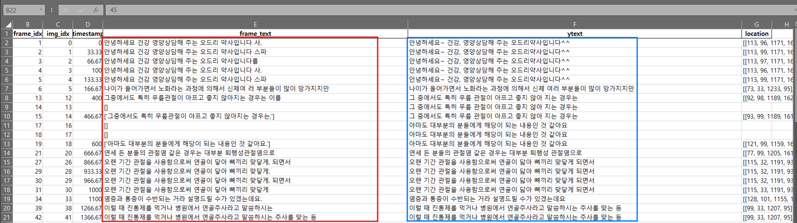
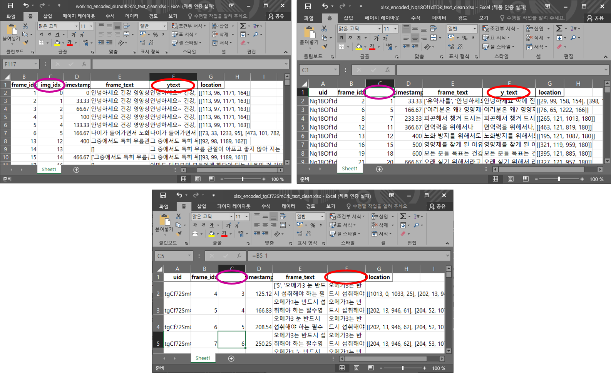
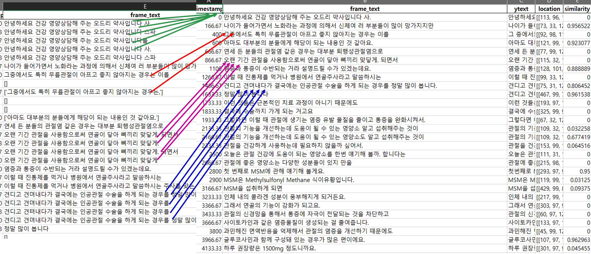
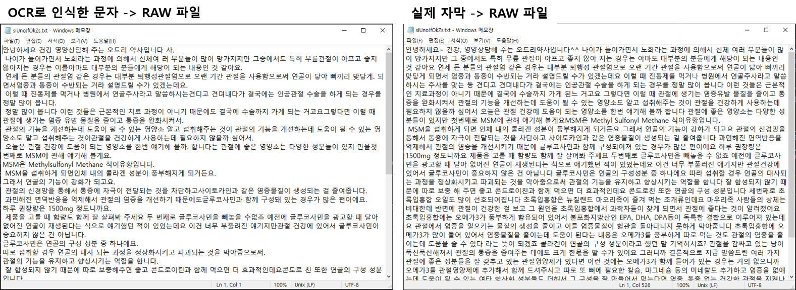

# 💬OCR 질의응답 테스팅
</img>
</img><br>
## ⚖️정의
BERT 기반의 질의응답 모델의 학습 과정에 KorQUAD 데이터셋 이용해서 다른 도메인에서 성능 평가하기 위해서 그 도메인 질문-응답 쌍 테스트셋을 만들어야 한다. 그 테스트셋을 만들기 위해서 OCR로 크롤링된 동영상 자막 내용을 뽁고 정보 전처리와 중복된 데이터를 없앤 다음에 사람 적접으로 내용 확인하고 질문-응답 테스트셋을 만든다.
## ▶설치
### 📥리포지터리 다운로드 받기
깃허브에서 로그인 한 후 다음 명령으로 리포지토리를 내려받으면 된다.
```
git clone https://github.com/youngdo1990/qna_tester.git
```
### 📝필요한 디펜던시 설치
```
pip install -r requirements.txt
```
### 🔢가중치 내려받기
질의응답 모델을 이용하기 위해서 학습한 가중치가 필요한다. 모델의 가중치 바이나리 파일을 얻기 위한 단계는 다음과 같다.<br><br>

output 폴더로 이돈하기
```
cd ./output
```
pysftp 라이브러리 설치
```
pip install pysftp
```
get_model.py 실행하기
```
python get_model.py
```
## ✂전처리
### 📄OCR 데이터
<br>
위에 이미지는 OCR 데이터 샘플이다. <b>frame_text</b> 칼럼은 OCR 인식한 텍스트며 <b>ytext</b> 칼럼은 사람 직접으로 작성한 자막이다.
### 🔧입력 파일 고치기
<br>
여러 사람들은 OCR 출력 파일을 수정하고 실제 자막을 입력해서 입력할 파일명 두 양식이 <b>(working&lowbar;encoded&lowbar;N&lowbar;&lt;uid&gt;&lowbar;text&lowbar;clean, xlsx&lowbar;encoded&lowbar;&lt;uid&gt;&lowbar;text_clean)</b> 있고 파일들 내용도 서러 조금 달라서 자동 분석할 때 데이터프레임 index 에로가 생기니까 그 차이 다루기 위해사 접근 2가지 있다. 첫 버째는 처리할 때 나오는 Exception 다루는 것이고 2번째는 입력한 파일 표준화하는 것이다.<br><br>

처리하면서 Exception 다루면 소스 코드가 복잡해지면서 프로그램 실행 시간이 늘어진다. 그렇기 때문에 다른 스크립을 만들었고 전처리 표준화하는 접근을 선택했다.
### 🔣중복된 문장 빼기
OCR로 자막 인식할 때 동영상 33 프레임마다 문자 인식해서 그 프레임 사이보다 더 걸린 자막 있어서 파일에 중복된 문장이 많고 OCR 성능이 때문에 실제 자막이 같은데 인식한 것이 서로 조금 다를 수도 있다. 그런 문장 처리를 하기 위해서 유사도 계산하고 비슷한 문자들을 그룹화한다.<br>
<br>
### 📃문서화
마지막으로 테스트 데이터셋을 만들기 위해서 엑셀 파일에 있는 정보를 RAW 파일에 넣어두면 된다. 생성한 파일로 질물-응답 데이터셋을 만들고 테스팅 프로그램을 돌려볼 때 uid 관련된 파일을 읽기만 하면 된다.<br><br>
실제 자막 내용의 파일과 OCR로 예측한 파일을 생성하고 다음 그림과 같다.<br>

# 🛠제작자 및 🤝협조자
## 👩🏻‍💻연구개발:제작&테스트
알바로(채환희) 전임연구원👑 (부산대학교 - 컴퓨터공학 석사) <br>
최어진(이든) 연구원🤝(부경대학교 - 일본어일문학) <br>
